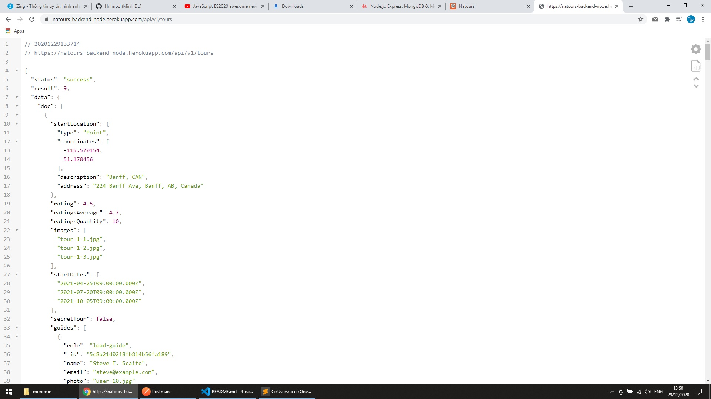
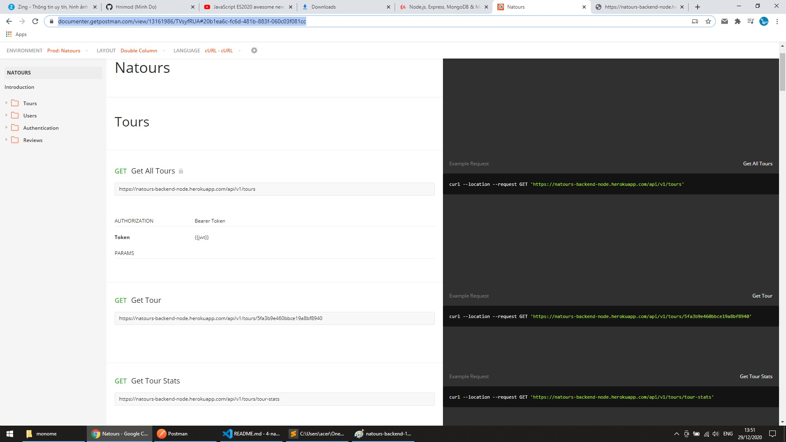

# Natours API End Point

Project that digs deep into NodeJS, Express, MongoDB, Mongoose. RESTful API supports CRUD operations, filtering, sorting, pagination, authentication, authorization ...

Back end: https://natours-backend-node.herokuapp.com/api/v1/tours  
API doc: https://documenter.getpostman.com/view/13161986/TVsyfRUA#20b1ea6c-fc6d-481b-883f-060c03f081cc

 

## Screenshots

## 

## 
